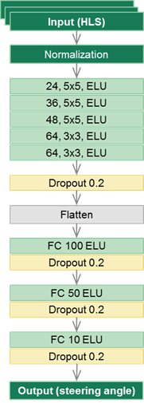

# SDC P3 Overview

## Training data
### Collection & Characteristics

The training data was collected with an Xbox 360 gaming controller. Multiple laps covering the entire track were recorded with the following characteristics:
- a smooth lap
- a wiggly lap with small wiggles to train the model to steer to the center
- a wiggly lap with large wiggles to train the model for course corrections when it's beginning to get off track
- multiple captures of the left turn following the bridge since it's a very sharp turn 
- multiple captures of the right turn following the above left turn since it's a very sharp turn
- recovery captures for the above two turns 

About 9000 images were captured. 

The training and validation data was split in a 95:5 ratio. The test sample was the autonomous simulator itself. 

### Preprocessing

In order to focus on the driving track, the top 1/4 of the image (40x320) was cropped off since it did not add to the features that the model needed to learn. Similarly, the bottom 25x320 pixels were cropped off since it only had the hood of the car. 

The image resolution was decreased to 66x200 to speeden processing without losing important feature information. 

The final image dimension is 66x200x3. 

### Augmentation

The captured training image data set was augmented by:
- randomly choosing between left, right and center camera images, and offsetting the steering angle by 0.25, -0.25 and 0 respectively
- randomly flipping (horizontally) the images to avoid left/right turn biases, and inverting the steering angles accordingly
- HLS color space transformation for all images, since it's quite close to how human perceive color and is able to differentiate brightness more concretely

This results in a larger training data set with more uniformly distributed steering angles.

### Examples

## Model
### Architecture

A convolutional neural network has been chosen due to its ability to extract and learn features from 2D images.

The input to the network are images generated by the training simulator converted to HLS-colorspace, along with the corresponding steering angles. The input was normalized with a Keras Lambda layer to limit the input values between -1 and 1 in order to have a well-conditioned data set. Experiments were carried out in RGB and YUV colorspaces too, but HLS produced the most optimal results.

The output from the network is the predicted steering angle. 

The weights of the network are trained to minimize the mean squared error between the steering angle that is generated by the network and the one from the manually simulated driving.

Final architecture (Source: [whitepaper](https://arxiv.org/pdf/1604.07316v1.pdf)):
INPUT -> NORMALIZATION -> [CONV -> ELU]x5 -> DROPOUT -> [FC -> ELU -> DROPOUT]x3 -> FC

Since the starting image size is not particularly small, strided convolution of 2x2 and a larger kernel size (5x5) were used for the first few conv layers, before reducing the stride to 1 and kernel size to 3x3 for the subsequent layers. 

Starting with a simpler initial model with just 2 CONVs and 1 FC + no pooling + no dropout, incremental additions and subtractions of non-linearity, Pooling, Hidden Layers and finally Dropouts were included to enhance the feature learning and to reduce overfitting.

Various different sizes for the filters and fully connected layers were experimented with, and the combination that has been chosen in the final architecture provided the best performance in these experiments. 

### Hyperparameters

* Filter/kernel size: 5x5 for first 3 conv layers, and 3x3 for last 2 conv layers
* Number of epochs: 15 
* Batch size: 64
* Learning rate: 0.0001
* Dropout rate: 0.2
* Optimizer: Adam
* Loss function: MSE
* Non-linear component: ELU
* Padding type: 'Valid'
* Stride size: 2x2 for first 3 conv layers, 1x1 for last 2 conv layers

### Fully annotated model

### Model summary

### Training

Adam optimizer was used with learning rate of 0.0001, batch size of 64 and each epoch spanning the full training data set. These values were empirically chosen after experimenting with learning rates of 0.001 and 0.00001. Batch sizes of 32, 128 and 256 were also tried. 

I trained the model for about 20 epochs and saved the intermediate weights values, and tested each one of them individually and determined that epoch #15 gave me the best performance. 

### Data generation

A custom training data generator was implemented and plugged into _keras' fit generator_ API, yielding a batch of transformed images to the trainer. Each epoch spanned 3x the number of training images.

## Autonomous mode testing
### Throttle adjustment

I reduced the throttle to 0.15 for a smoother performance.

### Performance

With this particular model, the car is able to complete the circuit repeatedly, without climbing onto hazardous kerbs or over the lane lines.

### Execution

The following command is used to execute the autonomous mode test for Track 1:

**_python drive.py model.json_**
