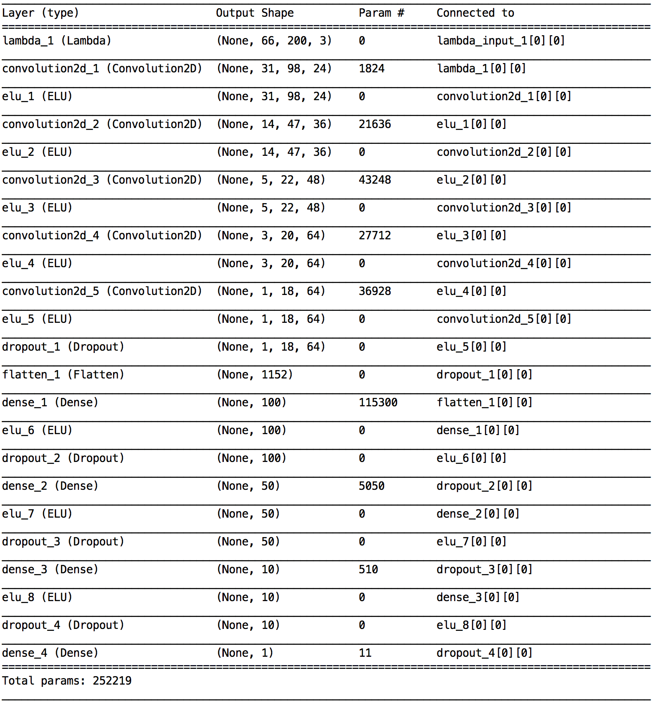

# SDC P3 Overview

## Training data
### Collection & Characteristics

The training data was collected with an Xbox 360 gaming controller. Multiple laps covering the entire track were recorded with the following characteristics:
- a smooth lap
- a wiggly lap with small wiggles to train the model to steer to the center
- a wiggly lap with large wiggles to train the model for course corrections when it's beginning to get off track
- multiple captures of the left turn following the bridge since it's a very sharp turn 
- multiple captures of the right turn following the above left turn since it's a very sharp turn
- recovery captures for the above two turns 

About 6300 images were captured. All of them were horizontally flipped to avoid left/right turn biases. Hence, total training data set was 12600.

The training and validation data was split in a 95:5 ratio. The test sample was the autonomous simulator itself. 

### Preprocessing

The image resolution was decreased from 160x320 to 80x160 to speeden processing without losing important feature information. 

In order to focus on the driving track, the top 1/4 of the image (20x160) was cropped off since it did not add to the features that the model needed to learn. Similarly, the bottom 10x160 pixels were cropped off since it only had the hood of the car. The final image dimension is 50x160x3. 

### Augmentation

The captured training image data set was augmented by horizontally flipping all the images to avoid left/right turn biases. The steering angles were correspondingly inverted. 

### Examples

## Model
### Architecture

A convolutional neural network has been chosen due to its ability to extract and learn features from 2D images.

The input to the network are RGB images generated by the training simulator, along with the corresponding steering angles. The input was normalized with a Keras Lambda layer to limit the input values between -1 and 1 in order to have a well-conditioned data set. No color space modifications are made.

The output from the network is the predicted steering angle. 

The weights of the network are trained to minimize the mean squared error between the steering angle that is generated by the network and the one from the manually simulated driving.

Final architecture:
INPUT -> NORMALIZATION -> [CONV -> ELU -> CONV -> ELU -> POOL -> DROPOUT]x3 -> [FC -> ELU -> DROPOUT]x3 -> FC

This architecture is similar to the one I used in the Traffic Signs project, except that I increased the Conv and FC sub-layers by 1.

Starting with a simpler initial model with just 2 CONVs and 1 FC, no pooling, no dropout, incremental additions of non-linearity, Pooling, Hidden Layers and finally Dropouts were included to enhance the feature learning and to reduce overfitting, before finally arriving at the above mentioned architecture.

Since the starting image size is not particularly small, strided convolution of 2x2 and a larger kernel size (5x5) were used for the first few conv layers, before reducing the stride to 1 and kernel size to 3x3 for the subsequent layers. Various different sizes for the filters and fully connected layers were experimented with, and the combination that has been chosen in the final architecture provided the best performance in these experiments. Ideas such as increased stride size and kernel size for initial convolutional layers were derived from the following [whitepaper](https://arxiv.org/pdf/1604.07316v1.pdf). 

### Hyperparameters

* Filter/kernel size: 5x5 for first 3 conv layers, and 3x3 for last 3 conv layers
* Number of epochs: 3
* Batch size: 32
* Learning rate: 0.0001
* Pooling stride: 2x2
* Dropout rate: 0.25 after Conv layers and 0.5 after FC layers
* Optimizer: Adam
* Loss function: MSE
* Non-linear component: ELU
* Padding type: 'Same'
* Stride size: 2x2 for first 3 conv layers, 1x1 for last 3 conv layers

### Fully annotated model

### Model summary

### Training

Adam optimizer was used with learning rate of 0.0001, batch size of 32 and each epoch spanning the full training data set. These values were empirically chosen after experimenting with learning rates of 0.001 and 0.00001. Batch sizes of 64, 128 and 256 were also tried. 

I trained the model for about 20 epochs and saved the intermediate weights values, and tested each one of them individually and determined that epoch #3 gave me the best performance. 

### Data generation

A custom training data generator was implemented and plugged into _keras' fit generator_ API, yielding a batch of transformed images to the trainer. Each epoch spanned ~12000 images.

## Autonomous mode testing
### Throttling model

A simplistic throttle function has been implemented to change the throttle depending on the steering angle to emulate regular driving. The throttle is dropped (in fact, it brakes to _-0.05_) while the car starts to make turns (when steering exceeds _abs(0.08)_) and accelerates to _0.3_ while finishing the turns (_>abs(0.2)_, which empirically signifies the end of the turn, because there is a delay before the higher speed takes effect). While driving straight (_[-0.08,0.08]_), the throttle stays at 0.15.

### Performance

With this particular model, the car is able to complete the circuit repeatedly, without climbing onto hazardous kerbs. However, this implementation assumes that driving on the yellow lane line markers and using the red/white kerbs are acceptable as it's a race track, and it's typical to use the red/white chicanes in order to maintain momentum.

### Execution

The following command is used to execute the autonomous mode test for Track 1:

**_python drive.py model.json_**
